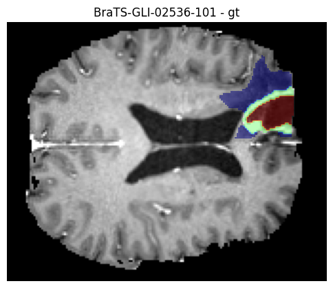

# 🧠 3D Brain Tumor Segmentation with MONAI (BraTS Dataset)

This project implements a 3D U-Net using the MONAI framework to segment brain tumors from multi-modal MRI scans in the BraTS dataset. The model distinguishes between tumor subregions—enhancing tumor, tumor core, and edema—using four MRI modalities: T1, T1Gd, T2, and FLAIR.

---

## 📊 Dataset

- **Source**: [BraTS GLI Dataset (Synapse)](https://www.synapse.org/Synapse:syn53708249/wiki/627759)
- **Input**: 4-channel 3D MRI volumes per patient
- **Output**: 4-class segmentation mask (labeling tumor subregions)

---

## 🧰 Tools & Libraries

- [MONAI](https://monai.io/) – Medical imaging workflows
- [PyTorch](https://pytorch.org/) – Model training
- [NiBabel](https://nipy.org/nibabel/) – NIfTI file handling

---

## ⚙️ Preprocessing Pipeline

- Channel-first volume formatting
- Z-score intensity normalization
- ROI cropping for memory efficiency
- Caching with `CacheDataset`
- Light data augmentation (random flips, intensity shifts)
- Padding for matching U-Net dimensions

---

## 🧠 Model Architecture

- **Network**: 3D U-Net (`monai.networks.nets.UNet`)
- **Patch Size**: 128 × 128 × 128
- **Batch Size**: 1 (adjustable)
- **Loss Function**: Dice Loss (+ optional Cross Entropy)
- **Metric**: Per-class Dice Score
- **Training Time**: ~10 hours on RTX 3070 (50 epochs)

---

## 📈 Results

- Achieves strong performance given the model complexity and hardware constraints, demonstrating effective use of resources
- Supports full-volume inference with sliding window
- Visualizes output masks overlaid on MRI slices

<p float="left">
  
  
</p>

---

## 📁 Project Structure

```
project_root/
├── data/             # BraTS dataset or symbolic links
├── src/              # Training and evaluation scripts
├── checkpoints/      # Saved model weights
├── results/          # Inference outputs and visualizations
├── output_images/    # PNG slice visualizations
└── README.md         # Project overview
```

---

## 📁 Prepare Folders

Before running, create necessary output folders:

```bash
mkdir results
mkdir checkpoints
mkdir output_images
```

---

## 🚀 Quick Start

```bash
# Install dependencies
pip install -r requirements.txt
```

1. Download the BraTS dataset from the provided Synapse link.
2. Set paths and training parameters in `run_train.sh` and `run_eval.sh`.
3. Configure U-Net hyperparameters in `modules.py`.

### Training & Evaluation
```bash
sh run_train.sh
sh run_eval.sh
```

---

## 💡 Additional Notes

- Trained on: RTX 3070 (8 GB VRAM)
- Optimizations: Mixed Precision (AMP), ROI cropping, dataset caching
- Compatible with lower-end GPUs using patch-based or reduced-sample training
